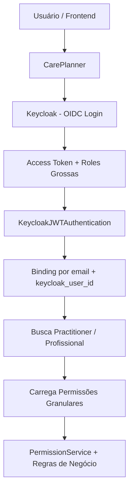
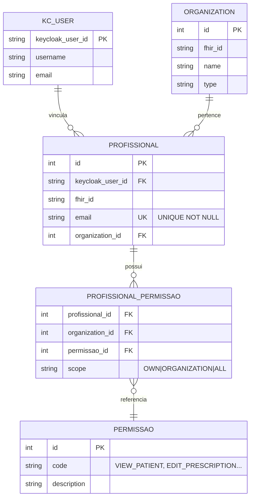

**✅ Aqui está o conteúdo completo e revisado em formato Markdown**, pronto para você copiar e colar no GitHub.

```markdown
# Integração Keycloak + CarePlanner (Base FHIR)

**Versão:** 1.1  
**Data:** 24/05/2026  
**Abordagem:** Spec Driven Development  
**Estratégia:** Modelo Híbrido de Autorização

---

## 1. Visão Geral e Estratégia Adotada

Este documento define a integração entre **Keycloak** (Identity Provider) e o **CarePlanner** (plataforma baseada em FHIR).

**Modelo Híbrido escolhido:**

- **Keycloak**: Responsável por **Autenticação** + **Papéis grossos** (Coarse-grained)
- **CarePlanner**: Responsável pelas **Permissões granulares** (Fine-grained) e regras de negócio específicas do domínio da saúde.

### Papéis no Keycloak (simplificados)

| Papel no Keycloak | Descrição |
|-------------------|-----------|
| `ADMIN`           | Administrador global do sistema |
| `GESTOR`          | Gestor de Organização / Clínica |
| `USUARIO`         | Profissional de saúde padrão |

> Todas as permissões finas (ex: `VIEW_PATIENT`, `EDIT_PRESCRIPTION`, `SCHEDULE_APPOINTMENT`, `MANAGE_ORGANIZATION_USERS`, etc.) serão gerenciadas **dentro do CarePlanner**.

---

## 2. Estado Atual (Baseline)

- Autenticação monolítica do Django (`username + password` → `auth_user`)
- Vinculação: `Profissional.usuario_id → auth_user.id`
- Permissões: Hardcoded em `settings.py` (exige re-deploy para alterações)
- Sem suporte nativo a SSO, MFA, OIDC ou multi-tenant
- Senhas gerenciadas diretamente pelo Django

**Problemas principais:**
- Forte acoplamento entre `auth_user` e `Profissional`
- Superfície de ataque desnecessária (senhas no Django)
- Dificuldade de escalar para múltiplas organizações

---

## 3. Ponto Crítico da Arquitetura Alvo

- **Binding principal**: `Profissional.objects.get(email=jwt_email)`
- **Ação urgente**: Alterar o campo `profissional.email` para `UNIQUE NOT NULL`
- Manter o `BaseModel.usuario_id` (FK para `auth_user`) como **stub temporário** durante a migração (Opção A) para minimizar impacto nas tabelas de auditoria.

---

## 4. Arquitetura da Integração



---

## 5. Modelo de Dados Recomendado



---

## 6. Fases de Implementação

**Fase 0: Preparação (Auditoria)**
- Auditar e corrigir emails duplicados/inválidos
- Tornar `profissional.email` UNIQUE NOT NULL
- Criar Realm e Client no Keycloak
- Configurar os 3 papéis grossos

**Fase 1: Autenticação Dual**
- Implementar `KeycloakJWTAuthentication`
- Modo híbrido: JWT + Sessão Django legada
- Binding por email + armazenamento do `keycloak_user_id`

**Fase 2: Frontend**
- Integrar `keycloak-js` no Kanban
- Receber e tratar o Access Token

**Fase 3: Autorização Granular**
- Desenvolver `PermissionService`
- Migrar permissões do settings.py para o banco
- Implementar regras baseadas em Profissional + Organização

**Fase 4: Migração Final**
- Remover autenticação Django legada
- Migrar Painel Admin do Django
- Desativar `auth_user` (opcional)

---

## 7. Vantagens da Abordagem Híbrida

- Keycloak mais leve e de fácil manutenção
- Maior flexibilidade para regras específicas do domínio FHIR
- Token JWT menor (melhor performance)
- Redução significativa da dívida técnica
- Preparação natural para SSO, MFA e multi-tenant futuro

---

**Próximos Passos Imediatos:**
1. Realizar auditoria dos emails (`profissional.email`)
2. Criar o Realm e Client no Keycloak
3. Implementar a Fase 1 (Autenticação Dual)

---

Documento alinhado com a visão discutida entre o time.
```

---

**Pronto!**  
Copie todo o conteúdo acima (do `# Integração...` até o final) e cole no GitHub.

Quer que eu ajuste alguma seção antes de você subir?